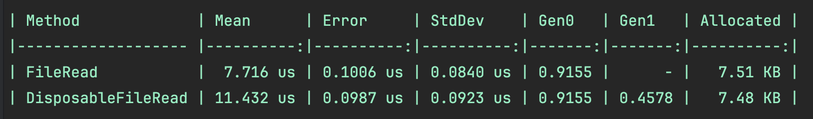

# 아이템 15: 불필요한 객체를 만들지 말라
## 개요
GC가 메모리를 관리하고 있다 해도 할당/해제하는 과정에서 오버헤드가 발생함. <br>
GC가 과도하게 작동하지 않도록 주의가 필요함.

## 불필요한 객체 생성 예제
```csharp
// OnPaint는 매우 자주 호출되는 이벤트 핸들러
protected override void OnPaint(PaintEventArgs e) 
{
    // 나쁜 예. Point 이벤트가 발생할 때마다 동일한 폰트를 생성한다.
    using (Font myFont = new Font("Arial", 10.0f))
    {
        e.Graphics.DrawString(DateTime.Now.ToString(),
            myFont,
            Brushes.Black,
            new PointF(0, 0));
    }
}
```
아래 코드는 매우 자주 호출되는 함수 `OnPaint`에서 매번 myFont를 생성하고 스코프를 벗어나는 순간 사용되지 않는 객체가 됨. <br>
또한 할당의 주기도 짧아져 GC가 자주 발생 할 수 있음.
```csharp
public void Dispose()
{
    _myFont.Dispose();
}

protected override void OnPaint(PaintEventArgs e) 
{
    e.Graphics.DrawString(DateTime.Now.ToString(),
        _myFont,
        Brushes.Black,
        new PointF(0, 0));
}

private Font _myFont = new Font("Arial", 10.0f);
```
멤버 변수로 설정해 `OnPaint`에서 재사용 하도록 설정해 개선 가능. <br>
**(주의)** `Font`와 같은 `IDisposable`인터페이스를 구현한 클래스를 멤버 변수로 사용한다면 비관리 자원을 해제하기 위해 그 클래스도 `IDisposable`인터페이스를 구현해야 함.

## 정적 변수의 재사용
위 `OnPaint`예제에서 `Brushes.Black`이 반복적으로 사용 중인데, 만약 매번 메모리 할당이 일어난다면 GC가 자주 발생할 수 있음.
```csharp
private static Brush s_blackBrush = null;

public static Brush BlackBrush
{
    get 
    {
        if (s_blackBrush == null)
            s_blackBrush = new SolidBrush(Color.Black);
        return s_blackBrush;
    }
}
```
Black을 최초로 호출될 때 생성됨. 그 이전에는 할당하지 않음. (지연평가, Lazy Evaluation) <br>
단점으로는 프로세스가 종료될 때까지 메모리에 남아 있어 `Dispose`로 비관리 리소스를 반환할 수 없음.

### 벤치마크

- FileRead는 Dispose를 구현하지 않은 클래스, DisposableFileRead는 Dispose를 구현한 클래스의 메서드 테스트
- FileRead는 Dispose를 구현하지 않았기 때문에 GC를 피해 FileRead가 더 빠르지만, 비관리 리소스가 해제되지 않아 누수 발생 할 수 있음.

## DI(Dependency Injection)
```csharp
// ASP.NET의 DI사용
builder.Services.AddSingleton<ServiceA>();
builder.Services.AddSingleton<ServiceB>();
...
class ServiceA
{
    ServiceA(ServiceB svcB) { ... }
}
```
자주 사용되는 객체를 생성 후 다른 클래스의 생성자에서 그 객체를 받아 매개변수처럼 사용할 수 있음.

## 문자열
(아이템 4참조)<br>
```csharp
string hello = "Hello,";
string tmp = hello + " World"; // 이론상 "Hello,"는 가비지가 되어야 하지만, 컴파일러 최적화로 인해 차이가 없는 경우가 있음.
string tmp2 = $"{hello} World"; // 가독성을 위해 보간문자열 사용하는 것이 좋음.
```
